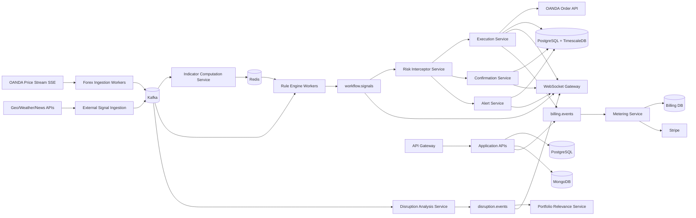

# Trading Automation Platform — Backend Architecture Specification

## 1. Purpose and Scope

This document defines the target backend architecture for a low-latency trading automation platform with:

- Real-time forex data ingestion and event processing.
- User-configurable workflow/rule execution.
- Multi-mode signal handling (alert-only, confirm-before-execute, auto-execute).
- Risk management enforcement.
- Commodity disruption intelligence for a globe visualization.
- Real-time client updates via WebSockets.
- Usage-based metering and billing.

The design prioritizes **event-driven processing**, **fault isolation**, and **horizontal scalability**.

---

## 2. Architecture Principles

1. **Event-first system design**
   - Core internal communication is asynchronous and broker-based.
   - Services are loosely coupled through immutable events.

2. **Low-latency hot path**
   - Tick ingestion → rule evaluation → risk check → execution remains in memory whenever possible.
   - No synchronous relational database queries in the per-tick critical path.

3. **Independent scalability**
   - Components scale independently via consumer groups and stateless workers.

4. **Operational resilience**
   - Circuit breakers, retries with backoff, idempotency keys, and dead-letter handling are mandatory.

5. **Auditability and replayability**
   - Persistent event logs and execution records support forensic analysis, compliance, and analytics.

---

## 3. High-Level Logical Architecture

---

## 4. Layered Component Design

## 4.1 Data Ingestion Layer

### Responsibilities
- Maintain persistent market data subscriptions to OANDA streaming endpoints.
- Normalize and validate inbound ticks.
- Publish canonical tick events to Kafka topics by instrument.

### Core Topics
- `prices.forex.<instrument>` (example: `prices.forex.EUR_USD`)
- `events.geo.raw`
- `events.weather.raw`
- `events.news.raw`

### Design Notes
- Keep stream consumers long-lived and reconnect-safe.
- Include source timestamp, ingest timestamp, instrument, bid/ask, and sequence metadata.
- Partition by instrument to preserve order within pair.

---

## 4.2 Rule Engine Layer

### Responsibilities
- Evaluate active user workflows against incoming market/indicator events.
- Emit signals corresponding to selected execution mode.

### Workflow Model
- User workflows are stored as JSON DAGs.
- Nodes:
  - Trigger nodes (price crosses, time windows, volatility thresholds).
  - Condition nodes (indicator checks, session constraints, user-specific predicates).
  - Action nodes (alert, confirm, execute).

### Performance Strategy
- Active rules loaded into Redis-backed cache and precompiled in worker memory.
- O(1)-style index lookup by instrument and trigger type.
- No per-event relational reads in hot path.

### Output Topic
- `workflow.signals` with event types:
  - `SIGNAL_ALERT`
  - `SIGNAL_PENDING_CONFIRMATION`
  - `SIGNAL_AUTO_EXECUTE`

---

## 4.3 Indicator Computation Service

### Responsibilities
- Maintain rolling windows and stateful technical indicators per instrument.
- Compute indicators such as RSI, MACD, Bollinger Bands.

### State Model
- Rolling windows and incremental computation state stored in Redis.
- Periodic snapshots or checkpoints for warm restart acceleration.

### Output
- Emits indicator updates for rule engine consumption.

---

## 4.4 Trade Execution Layer

### Execution Service
- Consumes approved `SIGNAL_AUTO_EXECUTE` signals.
- Sends orders to OANDA Order Management API.
- Persists execution outcome and emits user notifications.
- Enforces idempotency via unique `signal_id` + Redis key TTL lock.

### Confirmation Service
- Consumes `SIGNAL_PENDING_CONFIRMATION`.
- Creates pending order records and prompts user over WebSocket.
- Applies expiration windows (example: 30s) for auto-cancel behavior.

### Alert Service
- Consumes `SIGNAL_ALERT`.
- Delivers notifications (email, SMS, push, in-app).

### Persistence
- Execution and audit records written to PostgreSQL + TimescaleDB hypertables.

---

## 4.5 Risk Management Layer

### Responsibilities
- Intercept trade-intent signals before execution.
- Evaluate user-level limits:
  - Max position size
  - Daily loss cap
  - Max concurrent open trades
  - Drawdown thresholds

### Data Strategy
- Hot risk state maintained in Redis.
- Periodic reconciliation against broker account state via OANDA REST.

### Outcomes
- `RISK_APPROVED` routes to execution path.
- `RISK_REJECTED` triggers user-facing reason notifications + audit logs.

---

## 4.6 Commodity Globe Intelligence Layer

### Responsibilities
- Ingest geopolitical, weather, and news signals.
- Perform NLP sentiment and entity extraction.
- Classify disruptions by commodity class and severity.

### Topics
- Raw ingestion topics → enrichment pipeline → `disruption.events`

### Portfolio Relevance
- Match disruptions to user positions/exposures.
- Push only relevant disruptions to connected users.

### Geospatial Data
- Commodity hub and infrastructure geodata stored in PostGIS.
- Supports proximity filtering and map query capabilities.

---

## 4.7 API Gateway and Real-Time Layer

### API Gateway
- Responsibilities: auth, routing, rate limiting, usage tracking.
- JWT access tokens with refresh token rotation.

### WebSocket Gateway
- Maintains active connection map in Redis.
- Consumes event streams and performs targeted fan-out.
- Event classes: signal updates, order states, confirmations, disruption alerts.

---

## 4.8 Billing and Metering Layer

### Responsibilities
- Consume billable events from `billing.events`.
- Aggregate usage by account and billing period.
- Sync usage with Stripe usage-based billing.

### Billable Events (examples)
- Executed trades
- Premium signal evaluations
- High-frequency API access tiers

---

## 5. Data Storage Architecture

- **PostgreSQL + TimescaleDB**
  - Order executions, fills, PnL time series, latency metrics, audit trails.
- **Redis**
  - Hot path state: rule cache, indicator windows, risk counters, idempotency keys, WS connection maps.
- **PostgreSQL + PostGIS**
  - Geospatial commodity infrastructure and event overlays.
- **MongoDB**
  - User workflow JSON DAG definitions and versioned workflow metadata.

---

## 6. Topic Taxonomy (Reference)

- Market data: `prices.forex.*`
- Indicators: `indicators.forex.*`
- Rule outputs: `workflow.signals`
- Risk decisions: `risk.decisions`
- Execution lifecycle: `orders.lifecycle`
- Disruption intelligence: `disruption.events`
- Real-time notifications: `notifications.events`
- Billing: `billing.events`
- Dead-letter topics: `<topic>.dlq`

---

## 7. Non-Functional Requirements

1. **Latency**
   - Target p95 tick-to-order pipeline latency: `< 100ms` for auto-execute signals under nominal load.

2. **Scalability**
   - Horizontal scaling via Kafka consumer groups for ingest, rules, risk, and execution workers.

3. **Availability**
   - Graceful degradation when external providers fail.
   - Circuit breakers and bounded retries for broker/API dependencies.

4. **Consistency and correctness**
   - At-least-once processing with idempotent consumers in critical services.
   - Strict event schema versioning and contract validation.

5. **Security**
   - TLS in transit, secret rotation, least-privilege service identities.
   - Audit trails for all execution and risk decisions.

---

## 8. Deployment and Operations

- Platform runs on Kubernetes (EKS/GKE).
- Each service has independent autoscaling policy.
- Prioritize scaling for:
  - Rule engine workers
  - WebSocket gateway
  - Ingestion workers during market volatility windows
- Use blue/green or canary deployment for execution path services.
- Capture distributed traces (OpenTelemetry) across ingest → execution path.

---

## 9. Suggested Service Language Mapping

- **Go**: low-latency path services (ingestion, rules, risk, execution, WebSocket gateway).
- **Python**: data/NLP-heavy services (indicators, disruption analysis).
- **Node.js (optional)**: API composition layer where team productivity is highest.

---

## 10. Future Extensions

- Multi-broker abstraction layer (beyond OANDA).
- Backtesting/replay service using Kafka event logs.
- ML-based adaptive risk profiling.
- Regional data residency partitioning for compliance.
